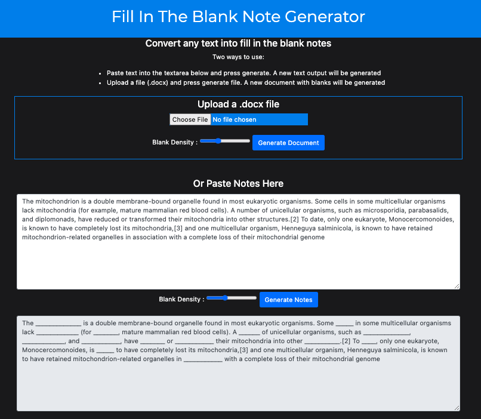

# fill-in-the-blank-note-generator
A web app that creates auto-generated fill in the blank notes.

Try it out on https://note-generator.herokuapp.com/

<h2>Objectives</h2>

Teachers often provide students with fill in the blank notes, or <a href="https://www.theteachertoolkit.com/index.php/tool/guided-notes#:~:text=Guided%20Notes%20are%20teacher%2Dprepared,%2C%20facts%2C%20definitions%2C%20etc.">guided notes </a>, to improve the student interaction in the material. These notes can be made by hand, or with tools such as <a href="https://www.interventioncentral.org/rti2/guided_notes">Guided-Notes Maker</a>. I had two major issues with existing sites that this project aimed to fix:

<ul>
  <li>The words to be blanked out must be selected by hand.</li>
  <li>The notes must be pasted in as plain text, which loses all formatting of the document.</li>
</ul>

<h4>Plain Text Notes</h4>

Paste in notes, and set the blank density as desired. Click 'Generate Notes' and new notes will output with autogenerated blanks.

<h4>Docx File</h4>

Upload a .docx file and click 'Generate Document' and a new file will be downloaded with autogenerated blanks.

 
<h2>Example </h4>
 

     

